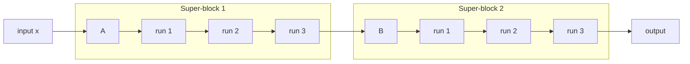
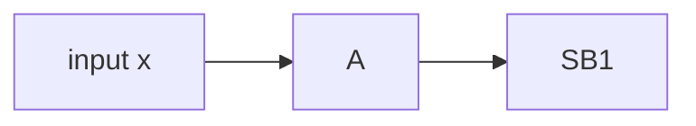

# Mermaid diagrams in Astro blogs — sizing and parser pitfalls

## Sizing

The default Mermaid render at ~600px wide with ~11px font looks small in
a blog prose column. The CSS fix lives in the layout file (e.g.
`src/layouts/BlogPost.astro`), not the post itself.

```css
.prose :global(.mermaid) {
  text-align: center;
  margin: 2.5rem 0;
  overflow-x: auto;   /* allow horizontal scroll on narrow viewports */
  width: 100%;
  max-width: 100%;
}

.prose :global(.mermaid svg) {
  display: inline-block;
  min-width: 720px;   /* the key property — force usable size */
  max-width: none;
  width: auto;
  height: auto;
  font-size: 16px;
}

.prose :global(.mermaid svg text) { font-size: 14px; }

@media (max-width: 768px) {
  .prose :global(.mermaid svg) { min-width: 560px; }
}
```

### Why `width: 100%` on the wrapper is not enough

Setting `width: 100%` on the `.mermaid` container doesn't propagate to the
inline `<svg>` it contains. The SVG renders at whatever intrinsic size
Mermaid computed during layout. `min-width` on the SVG itself is what
forces it to expand; the wrapper then handles overflow with
`overflow-x: auto`.

### Tested versions

- Mermaid 11.16.0 (CDN: `mermaid@11/dist/mermaid.esm.min.mjs`) — works
- Astro 7 with `astro:assets` Image for hero images but plain markdown
  image syntax for inline figures — works

## Parser pitfalls (Mermaid 11.x)

### 1. Node / subgraph ID collision

```mermaid
flowchart LR
    A[x] --> SB1                  # parses as edge, OK
    subgraph SB1["Super-block"]   # subgraph ID is SB1
        SB1 --> SB1b["..."]       # ERROR — SB1 is both node and subgraph
    end
```

Fix: use distinct IDs.



### 2. Edge source with shape syntax

```mermaid
flowchart LR
    A[x] --> SB1   # WRONG — A[x] is a single shaped-node token
```

Fix: separate the shape from the edge.



### 3. Unicode subscripts in node labels

`SB₁`, `SB₂` sometimes trip Mermaid 11.16's parser when combined with
edge cases. If you hit "Syntax error in text" and can't spot the
structural issue, drop the subscripts — readability gain is usually
minimal anyway.

### 4. Self-referencing edges for cycles

For "this loops N times" semantics, prefer showing three explicit
`run 1 → run 2 → run 3` nodes over a self-loop like `A -->|R=3| A` —
visually clearer and doesn't depend on edge-label parsing.

## Validating syntax locally

Before relying on browser-rendered output, sanity-check the syntax with
the Mermaid CLI:

```bash
npx -y -p @mermaid-js/mermaid-cli@11 mmdc \
    -i diagram.mmd -o diagram.svg -q \
    -p puppeteer.json
```

`puppeteer.json` needs:

```json
{"args": ["--no-sandbox"]}
```

because Linux sandboxes will block Chromium. Exit 0 + non-zero SVG size
= syntax is valid. Exit 1 + stderr pointing at a line number = real
parse error.

## Theme-aware rendering

If the blog supports dark mode, render diagrams with a theme switch:

```js
const getMermaidTheme = () =>
  document.documentElement.getAttribute('data-theme') === 'dark'
    ? 'dark' : 'neutral';

const observer = new MutationObserver(() => mermaid.run({ querySelector: '.mermaid' }));
observer.observe(document.documentElement, { attributes: true, attributeFilter: ['data-theme'] });
```

The user's `BlogPost.astro` already does this — leave it alone unless
the user asks for a theme change.
